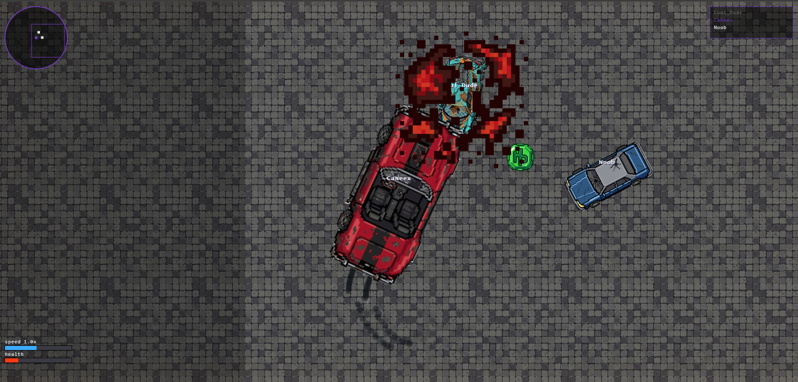
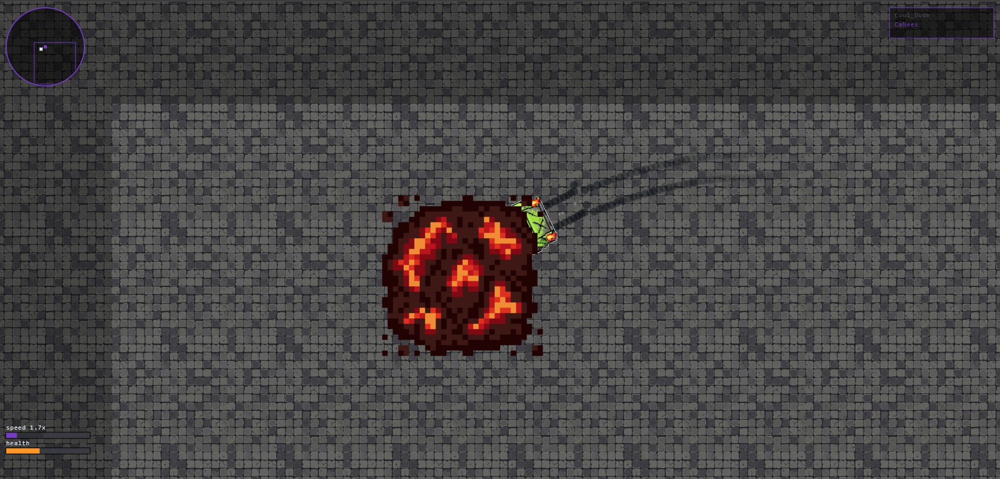
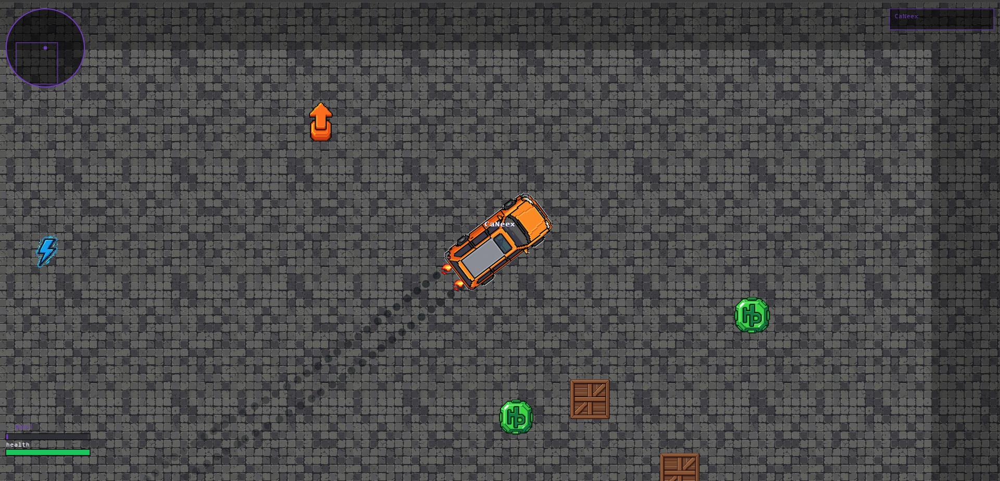

# PixDerby

Fast-paced arcade racing prototype with dynamic boosts, explosions, and chaotic gameplay.

---

## Gameplay Overview

<p align="center">
  
</p>

---

## Core Moments

<p align="center">
  
  
</p>


---

## About the Project

PixDerby is a prototype focused on fast arcade gameplay, reaction timing, and dynamic in-game events.

The main goal is to explore gameplay feel before system complexity and long-term scaling.

---

## Gameplay Demo

<p align="center">
  <video width="360" controls>
    <source src="https://github.com/user-attachments/assets/ce21b865-7955-4cf8-911d-2c0aa8b9a293" type="video/mp4">
  </video>
</p>

<p align="center">
  <video width="360" controls>
    <source src="https://github.com/user-attachments/assets/6808cc00-acb3-4cc6-9679-bc872f9cf461" type="video/mp4">
  </video>
</p>

<p align="center">
  <video width="360" controls>
    <source src="https://github.com/user-attachments/assets/249a527b-c967-4fbd-b7d6-b8566ce16615" type="video/mp4">
  </video>
</p>

---

## Features

- Boost system with dynamic spawn logic  
- Explosion and impact effects  
- Fast arcade movement  
- Lightweight prototype structure  
- Gameplay-first design approach  

---

## Project Structure

```text
client/
├── assets/
│ ├── photo/
│ │ ├── demo_01_explosion.png
│ │ ├── demo_02_boost.png
│ │ └── demo_03_gameplay.png
│ ├── cars/
│ ├── map/
│ └── video/
│ ├── demo_01_explosion.mp4
│ ├── demo_02_boost.mp4
│ └── demo_03_menu.mp4
├── style.css

server/
├── derby.exe
├── core logic / build output

README.md
```
---

## Status

Early prototype stage focused on gameplay feel, iteration speed, and core mechanics testing.
